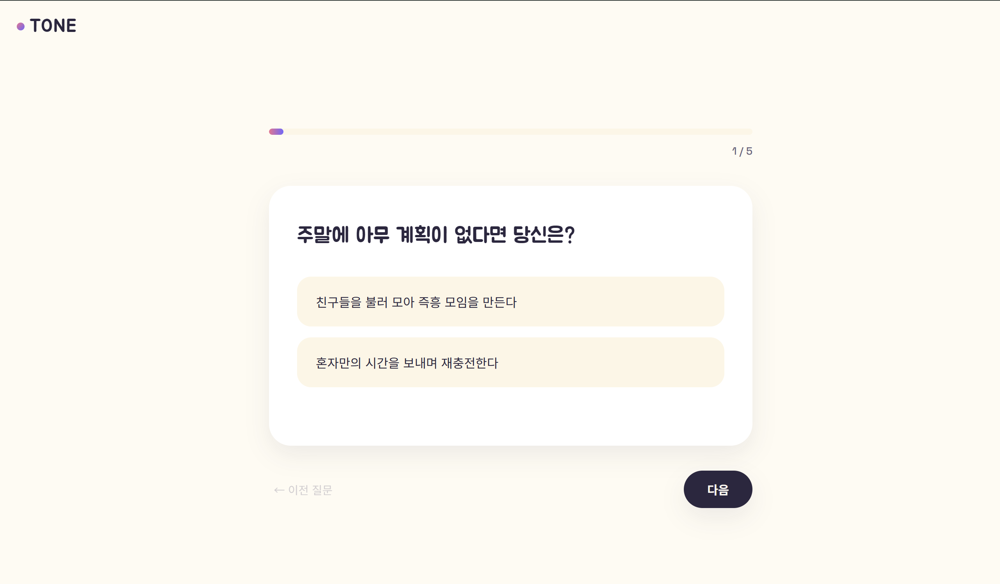
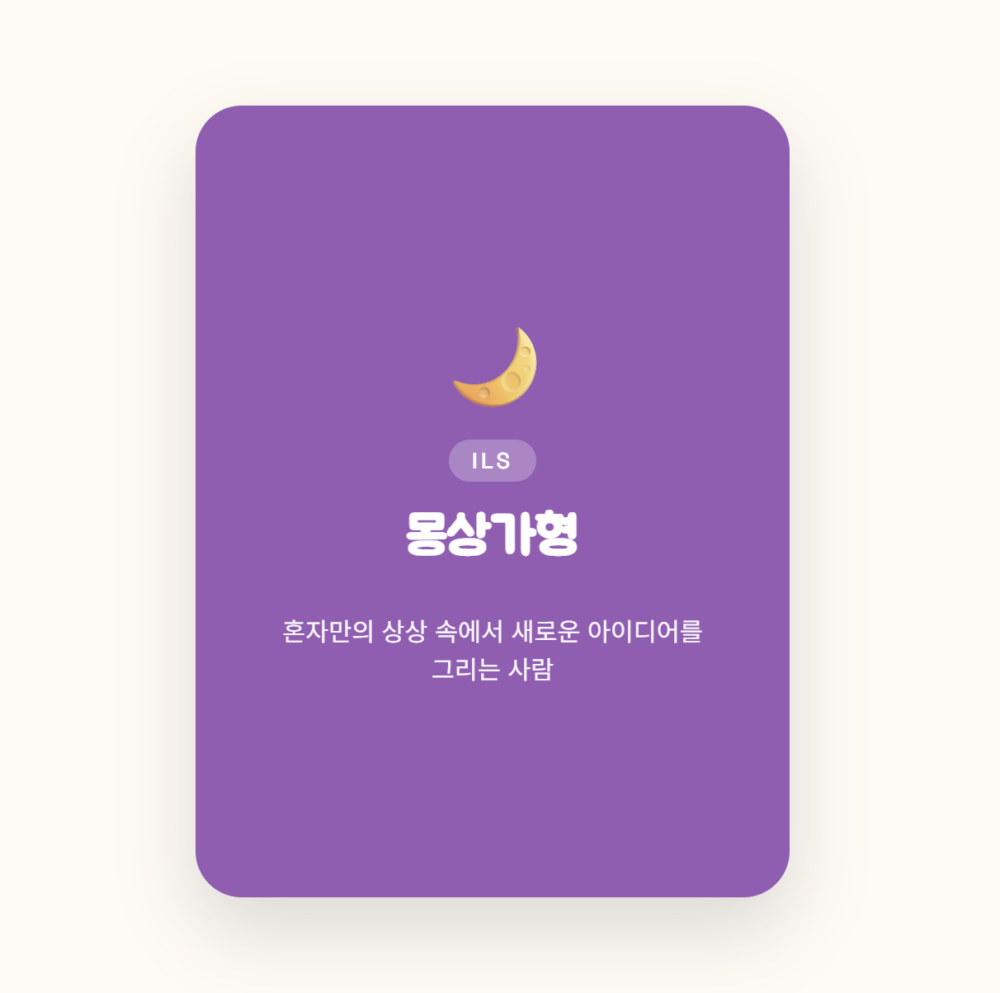
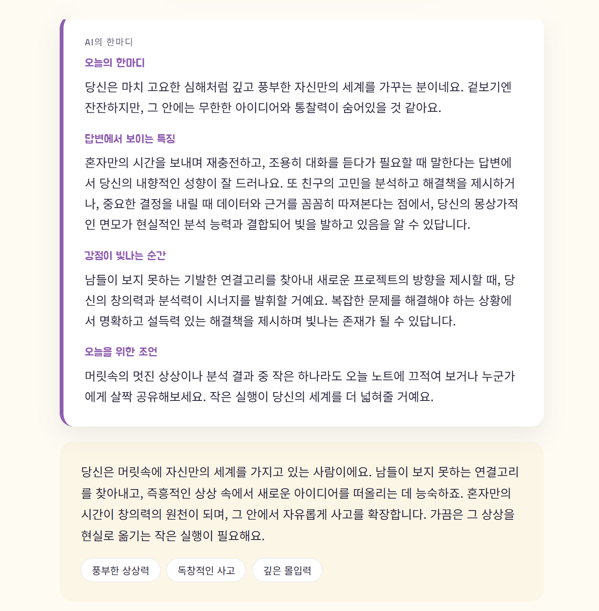

# TONE — 성향 컬러 테스트

🔗 **배포 링크**: [https://a-3-seven.vercel.app/](https://a-3-seven.vercel.app/)

> 5문항(빠른 진단) 또는 10문항(정밀 진단)에 답하면, AI가 8가지 성향 컬러 유형 중 하나로 나만의 결과 카드를 그려주는 웹 서비스입니다.

---

## 목차

1. [프로젝트 개요](#1-프로젝트-개요)
2. [화면 구성 살펴보기](#2-화면-구성-살펴보기)
3. [AI 기능 소개](#3-ai-기능-소개)
4. [기술 스택 및 프로젝트 구조](#4-기술-스택-및-프로젝트-구조)
5. [실행 및 배포 방법](#5-실행-및-배포-방법)
6. [환경 변수](#6-환경-변수)
7. [반응형 디자인](#7-반응형-디자인)
8. [개발 과정에서 겪은 문제와 해결](#8-개발-과정에서-겪은-문제와-해결)
9. [향후 보완할 사항](#9-향후-보완할-사항)

---

## 1. 프로젝트 개요

**TONE**은 정해진 질문에 답하면 8가지 성향 컬러 유형(설계자형·도전가형·리더형·탐험가형·분석가형·몽상가형·중재자형·조력자형) 중 하나를 진단해주는 서비스입니다. MBTI처럼 복잡한 유형 체계 대신, **에너지 방향(E/I) · 판단 방식(L/F) · 실행 방식(P/S)** 세 가지 축의 조합만으로 8가지 유형을 명확하게 구성했습니다.

이 서비스의 핵심은 단순히 정해진 결과를 보여주는 데서 그치지 않는다는 점입니다. 유형 자체는 **미리 정의된 채점 로직**으로 결정되지만, 그 결과를 설명하는 코멘트는 **AI가 사용자의 실제 답변을 근거로 매번 새롭게 생성**합니다. 여기에 더해, 결과 화면에서 자기 유형에 대해 자유롭게 질문하고 답을 들을 수 있는 대화형 기능도 추가해, 정적인 테스트가 아니라 상호작용이 있는 경험을 만들고자 했습니다.

**타겟 사용자**는 재미로 자기 이해를 하고 싶은 사람, 결과를 캡처해 SNS나 메신저로 공유하고 싶은 사람입니다. 이를 위해 결과 카드를 이미지로 다운로드할 수 있는 기능도 넣었습니다.

---

## 2. 화면 구성 살펴보기

서비스는 하나의 페이지 안에서 화면을 전환하는 SPA(단일 페이지 애플리케이션) 구조로, 홈 → 모드 선택 → 문제 풀이 → 결과 순서로 이동합니다. 상단 로고를 클릭하면 언제든 홈으로 돌아갈 수 있습니다.

### 2-1. 홈 화면

첫 화면은 서비스를 짧게 소개하는 히어로 영역으로 시작합니다. "당신은 어떤 색의 사람인가요?"라는 질문형 헤드라인과 함께, 배경에는 부드럽게 떠다니는 컬러 블롭 애니메이션을 넣어 밝고 화사한 분위기를 냈습니다. 스크롤을 내리면 8가지 성향 유형을 카드 형태로 미리 소개하는 갤러리 섹션이 순서대로 나타나며, 각 카드는 화면에 들어올 때마다 살짝 떠오르는 애니메이션으로 등장합니다.

> 🖼️ ** — 홈 화면**
>
> 
> *
*
>
> 
> *(모바일 화면 캡처를 여기에 삽입하세요)*

### 2-2. 모드 선택 화면

"테스트 시작하기" 버튼을 누르면 진단 방식을 고르는 화면으로 넘어갑니다. 시간이 부족한 사용자를 위한 **빠른 진단(5문항, 약 1분)**과, 더 정교한 결과를 원하는 사용자를 위한 **정밀 진단(10문항, 약 3분)** 두 가지 카드를 나란히 배치해, 사용자가 자신의 상황에 맞게 선택할 수 있도록 했습니다.

> 🖼️ **스크린샷 삽입 위치 — 모드 선택 화면**
>
> 
> *
*

### 2-3. 문제 풀이 화면

질문은 한 화면에 몰아서 보여주지 않고, **한 문제씩** 순차적으로 노출됩니다. 상단의 진행률 바와 "3 / 5" 같은 텍스트로 남은 문항 수를 안내해 지루함을 줄였습니다. 답을 선택하지 않고 다음으로 넘어가려 하면 "옵션을 선택해주세요"라는 경고 문구가 표시되어, 빈 응답 없이 채점이 진행되도록 처리했습니다.

> 🖼️ **스크린샷 삽입 위치 — 문제 풀이 화면**
>
> 
> *
*

### 2-4. 결과 화면

마지막 문항에 답하면 카드가 뒷면에서 앞면으로 뒤집히는 연출과 함께 결과가 공개됩니다. 카드에는 확정된 유형의 이모지·이름·3글자 코드(예: EFS)가 표시되고, 그 아래로 AI가 생성한 개인화 분석, 유형 설명, 강점 태그, 궁합이 좋은 유형 안내가 순서대로 나타납니다. 화면 하단에는 자신의 유형에 대해 자유롭게 질문할 수 있는 "AI에게 더 물어보기" 입력창과, 다시 하기·홈으로·카드 다운로드 버튼이 있습니다.

> 🖼️ **스크린샷 삽입 위치 — 결과 화면 (AI 기능 동작 장면)**
>
> 
> *
*
> 
> 
> *
*
>
> 
> *
*

---

## 3. AI 기능 소개

### 3-1. 결과 분석 코멘트 (`/api/analyze`)

퀴즈가 끝나면 프론트엔드에서 먼저 정해진 채점 로직으로 유형을 확정합니다. 이후 확정된 유형 정보와 사용자가 각 문항에서 실제로 고른 답변 목록을 서버로 전송하면, AI가 이를 바탕으로 **오늘의 한마디 / 답변에서 보이는 특징 / 강점이 빛나는 순간 / 오늘을 위한 조언**, 총 4단락의 분석을 생성해 돌려줍니다. 단순히 유형에 대한 일반적인 설명을 반복하는 게 아니라, 사용자가 실제로 선택한 답변 내용을 근거로 언급하도록 프롬프트를 설계해 개인화된 느낌을 살렸습니다.

### 3-2. AI에게 더 물어보기 (`/api/ask`)

결과 화면에서 그치지 않고, 사용자가 자기 유형에 대해 궁금한 점을 직접 입력하면 AI가 답해주는 기능입니다. 예를 들어 "이 유형은 연애할 때 어떤 편이야?"처럼 자유롭게 질문하면, 확정된 유형 정보를 맥락으로 넣어 2~3문장의 답변을 받아볼 수 있습니다. 정적인 결과 열람에 머무르지 않고 대화형으로 확장했다는 점에서, 미션이 요구한 "AI 기능 1개 이상"이라는 최소 기준을 넘어 서비스의 완성도를 높이고자 한 부분입니다.

### 3-3. 이중 안전망 — Gemini → Groq → 정적 설명

두 AI 기능 모두 **Google Gemini API(`gemini-2.5-flash`)**를 기본으로 사용합니다. 다만 무료 API는 하루 요청 한도가 낮아, 여러 사람이 몰려 테스트하는 상황(예: 발표·평가 시연)에서 한도가 소진될 가능성을 고려했습니다. 이를 위해 Gemini 호출이 실패하면 자동으로 **Groq API(`llama-3.3-70b-versatile`)**로 재시도하는 백업 구조를 추가했고, 그마저 실패하면 사전에 작성해둔 정적 유형 설명으로 자연스럽게 대체됩니다. 즉 어떤 상황에서도 결과 화면 자체는 끊기지 않고, 사용자에게는 상황에 맞는 안내 메시지만 조용히 노출됩니다.

**실패 처리 기준**은 다음과 같이 세 가지 상황을 모두 다룹니다.

- **빈 입력**: 질문을 선택하지 않거나 입력하지 않고 진행하려 하면 인라인 경고 메시지를 표시하고 진행을 막습니다.
- **API 오류(4xx/5xx)**: Gemini 실패 시 Groq으로 자동 전환을 시도하고, 그래도 실패하면 토스트 메시지로 안내한 뒤 정적 설명으로 대체합니다.
- **지연/타임아웃**: 요청 후 15초가 지나도 응답이 없으면 요청을 중단하고 동일하게 안내·대체 처리합니다.

---

## 4. 기술 스택 및 프로젝트 구조

| 영역 | 기술 |
|---|---|
| 프론트엔드 | HTML5, CSS3, Vanilla JavaScript (프레임워크 미사용) |
| 백엔드 | Vercel Serverless Functions (Python) |
| AI (주 provider) | Google Gemini API (`gemini-2.5-flash`) |
| AI (백업 provider) | Groq API (`llama-3.3-70b-versatile`) |
| 배포 | Vercel + GitHub 연동 |
| 기타 | html2canvas (결과 카드 이미지 다운로드) |

프로젝트는 프론트엔드와 백엔드가 명확히 분리된 구조입니다.

```
.
├── index.html              # 메인 페이지 (홈 / 모드선택 / 퀴즈 / 결과 뷰)
├── css/
│   └── style.css
├── js/
│   ├── types.js              # 8가지 성향 유형 데이터
│   ├── questions.js           # 고정 질문 문항 (5/10문항)
│   └── app.js                   # 화면 전환·채점·AI 호출 로직
├── api/
│   ├── analyze.py               # AI 기능 ① 결과 코멘트 생성 (Gemini → Groq)
│   └── ask.py                    # AI 기능 ② 추가 질문 답변 (Gemini → Groq)
├── requirements.txt
├── .env.example
├── PLANNING.md
└── README.md
```

`api/analyze.py`, `api/ask.py`는 반드시 저장소 최상위의 `api/` 폴더 바로 아래 위치해야 합니다. Vercel은 폴더 경로를 그대로 URL 경로로 매핑하기 때문에, 위치가 어긋나면 해당 엔드포인트가 존재하지 않는 것으로 처리되어 404 오류가 발생합니다.

---

## 5. 실행 및 배포 방법

### 로컬 실행

이 프로젝트는 Vercel Serverless Functions를 사용하므로, AI 기능까지 로컬에서 확인하려면 Vercel CLI로 실행하는 것을 권장합니다.

```bash
# 의존성 설치
npm install -g vercel
pip install -r requirements.txt

# 환경 변수 설정
cp .env.example .env
# .env 파일을 열어 GEMINI_API_KEY(필수), GROQ_API_KEY(선택) 입력

# 로컬 개발 서버 실행
vercel dev
```

정적 파일(`index.html`)만 브라우저로 직접 열면 화면 확인은 가능하지만, `/api`를 서빙해줄 서버가 없어 AI 기능은 항상 대체 콘텐츠로 처리됩니다. 이는 정상적인 동작이며, AI 기능까지 실제로 확인하려면 `vercel dev` 또는 실제 배포가 필요합니다.

### 배포

1. 저장소를 GitHub에 push합니다. (최상위에 `index.html`, `css/`, `js/`, `api/`가 바로 보이는 구조여야 합니다.)
2. Vercel에 GitHub 계정으로 로그인 후 **Add New → Project**로 저장소를 import합니다.
3. Build 설정은 기본값 그대로 두고, **Deploy 전에** 환경 변수를 먼저 등록합니다.
4. Deploy를 진행하면 1~2분 뒤 배포 URL이 발급됩니다.
5. 이후 코드를 수정하고 `git push`하면 Vercel이 자동으로 재배포합니다.

---

## 6. 환경 변수

| 변수명 | 필수 여부 | 설명 | 발급처 |
|---|---|---|---|
| `GEMINI_API_KEY` | 필수 | AI 기능의 주(primary) provider | [Google AI Studio](https://aistudio.google.com/apikey) |
| `GROQ_API_KEY` | 선택 | Gemini 호출 실패 시 자동 전환되는 백업 provider | [Groq Console](https://console.groq.com/keys) |

API 키는 코드나 README, 스크린샷에 직접 노출하지 않습니다. 로컬에서는 `.env`(`.gitignore`로 제외), 배포 환경에서는 Vercel Environment Variables를 사용합니다. Vercel에서 환경 변수를 새로 추가하거나 수정한 뒤에는 반드시 **Redeploy**를 실행해야 배포에 반영됩니다. 키가 유출된 것으로 의심되는 경우, 해당 콘솔에서 즉시 키를 폐기·재발급하고 커밋 이력에 남아있다면 함께 정리합니다.

---

## 7. 반응형 디자인

데스크톱(4열 카드 그리드) → 태블릿(2열) → 모바일(1~2열, 버튼 세로 스택)로 화면 크기에 따라 레이아웃이 자동으로 조정되도록 구성했습니다. 진행률 바와 "N / 총문항" 표시로 모바일에서도 남은 분량을 쉽게 인지할 수 있게 했고, 결과 화면의 액션 버튼들은 모바일에서 세로로 쌓여 터치 영역이 좁아지지 않도록 처리했습니다.

> 🖼️ **스크린샷 삽입 위치 — 반응형 확인**
>
> 
> *(예: 1920px 데스크톱 화면)*
>
> 
> *(예: 390px 모바일 화면)*

---

## 8. 개발 과정에서 겪은 문제와 해결

배포와 테스트를 진행하면서 몇 가지 문제를 실제로 겪었고, 그 과정에서 원인을 파악하고 수정하는 과정을 거쳤습니다.

**저장소 구조 문제로 인한 CSS 미적용.** 처음 GitHub에 push했을 때, 저장소 안에 프로젝트 폴더가 한 단계 더 들어가 있는 구조였습니다. Vercel은 저장소 최상위를 기준으로 파일을 찾기 때문에, 최상위에 남아있던 예전 버전의 `index.html`을 그대로 읽어 CSS 경로가 깨진 상태로 배포되었습니다. 하위 폴더 안의 파일들을 저장소 최상위로 옮기고 중복 파일을 정리한 뒤 다시 push하여 해결했습니다.

**`api` 폴더 위치로 인한 404 오류.** 구조를 정리하는 과정에서 `analyze.py` 파일이 `api` 폴더 없이 최상위에 바로 놓이게 되었습니다. Vercel은 폴더 경로를 그대로 URL 경로로 사용하므로, `api` 폴더가 없으면 `/api/analyze`라는 주소 자체가 존재하지 않는 것으로 처리됩니다. 파일을 `api/analyze.py` 경로로 정확히 재배치하여 해결했습니다.

**AI 모델 지원 종료.** 구조 문제를 해결한 뒤에도 AI 호출이 계속 실패했는데, 원인을 확인해보니 코드에 명시했던 `gemini-2.0-flash` 모델의 API 지원이 이미 종료된 상태였습니다. 현재 사용 가능한 `gemini-2.5-flash`로 모델명을 변경하여 해결했습니다.

**AI 응답이 한두 어절에서 잘리는 문제.** 모델을 교체한 뒤 AI 코멘트가 정상적으로 오긴 했지만 "와, 당신은 역시"처럼 문장 중간에서 끊기는 현상이 있었습니다. 확인해보니 `gemini-2.5-flash`는 답변을 생성하기 전에 내부적으로 소비하는 사고(thinking) 토큰이 응답 길이 한도(`maxOutputTokens`) 안에 포함되는데, 당시 설정한 한도(200)가 지나치게 낮아 실제 답변에 쓸 토큰이 거의 남지 않았던 것이 원인이었습니다. `thinkingConfig.thinkingBudget`을 0으로 설정해 사고 단계를 생략하고, 응답 한도를 넉넉하게 올려 해결했습니다.

**무료 할당량 소진 우려.** 코멘트 품질을 높이며 응답 길이가 늘어난 김에, Gemini 무료 티어의 하루 요청 한도가 낮다는 점도 함께 고려했습니다. 여러 사람이 동시에 테스트하는 상황에서 한도가 소진될 가능성에 대비해, Gemini 호출이 실패하면 자동으로 Groq으로 전환되는 이중 구조를 추가했습니다.

---

## 9. 향후 보완할 사항

- 데스크톱/모바일 화면, AI 기능 동작 스크린샷을 위 각 섹션의 삽입 위치에 채워 넣기
- AI 코딩 도구 사용 과정(대화 로그 또는 스크린샷) 정리
- 최소 2개 이상의 화면 크기에서 반응형 레이아웃 직접 확인
- 배포 URL을 동료에게 공유해 접속·동작 재현 여부 확인
